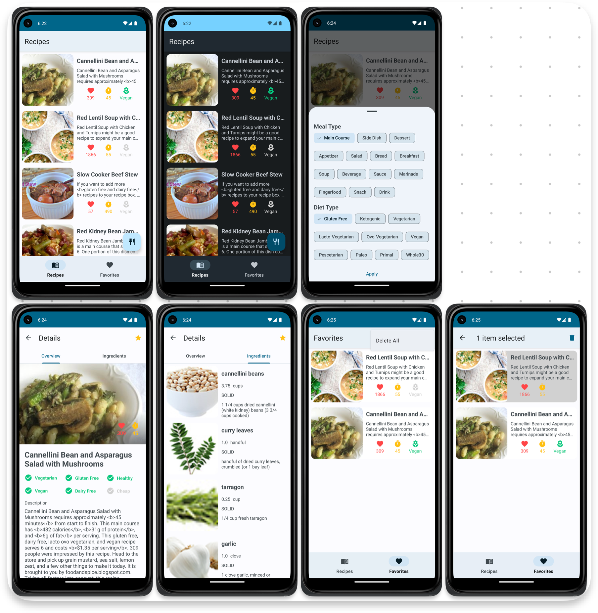

# FitFuel

## About

### Description

FitFuel is a pet-project that provides the ability to find out interesting recipes

### Architecture

Clean Architecture with MVVM Pattern

### Technologies

- Kotlin (with Coroutines)
- Room
- Retrofit
- OkHttp
- Gson
- Navigation
- Dagger-Hilt
- LiveData
- Coil
- DiffUtil
- DataStore
- DataBinding

### Screenshots

